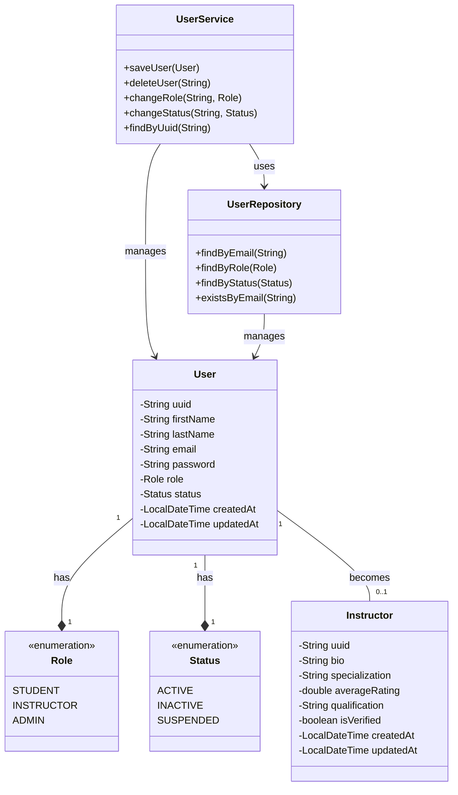

# User Service

This service handles user management operations including user creation, role management, and status updates.

## Prerequisites

To view the UML diagram in this README:
1. Install the "Markdown Preview Mermaid Support" extension in VS Code:
   - Open VS Code
   - Press `Ctrl+P`
   - Type `ext install bierner.markdown-mermaid`
   - Press Enter to install
2. Open this README.md file
3. Press `Ctrl+Shift+V` to preview with the rendered Mermaid diagram

## Class Diagram

## Service Architecture

- **Entities**: 
  - `User`: Core entity representing system users
  - `Instructor`: Extended entity for users with instructor role
  - `Role`: Enumeration of possible user roles
  - `Status`: Enumeration of possible user states

- **Repository Layer**:
  - `UserRepository`: Handles data persistence operations

- **Service Layer**:
  - `UserService`: Business logic implementation
  - `UserServiceImpl`: Concrete implementation of user operations

## Key Features

- User management (CRUD operations)
- Role-based access control
- Status management
- Email uniqueness validation
- Instructor profile management

## Testing

The service includes comprehensive unit tests using:
- JUnit 5
- H2 in-memory database
- Spring Test context
- Test profile configuration

## Technologies

- Spring Boot
- Spring Data JPA
- Lombok
- H2 Database (Test)
- JUnit 5